title: VueJS
class: animation-fade
layout: true

<!-- This slide will serve as the base layout for all your slides -->
.bottom-bar[
  {{title}}
]

---

class: impact

# {{title}}
## Javascript framework

---

# What is Vue?

> Pronounced /vjuː/ (like view) is a progressive javascript framework for building user interfaces.

## Strong points

- Focus (build user interfaces)
- Simplicity (syntax is simple and easy to follow)
- Compactness (25kb more or less, no 1 million dependencies)
- Speed (Angular, react, meteor...)
- Versatility (works well for small and sophisticated apps)

---

# Basics

- Virtual DOM
> Working with a copy of DOM and update differences in real DOM
- Reactive: data changes => DOM changes
- A Vue instance/component works like a (view)model. Populating and mutating its own data
> Isolated components in .vue files
- Easy to install
> Project template vue-cli manager
- Detailed, clean and understandable docs

---

# Basics - Properties and Methods

- `data`: Object with stored properties that become reactive
- `computed`: Object with computed properties and use like data properties
- `methods`: Object with stored functions to use

> All properties and methods could be used in component/instance or in its html template

Vue proxies all properties in *data*, *computed*, and *methods* to __root__ object

---

# Basics - Vue Instance

- An application is started with one Vue Instance

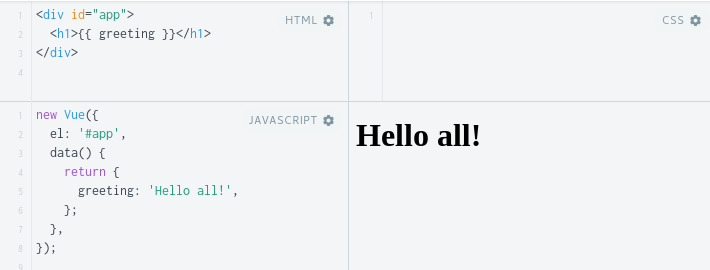

---

# Basics - Vue Instance

- An application is started with one Vue Instance

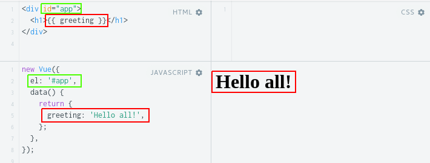

---

# Basics - Lifecycles

.col-2[

]

.col-10.text-small[
- `beforeCreate`: First event, before element added to DOM (also run in server-side rendering); **data** has not been made reactive and **events** have not been set up yet
- `created`: Can access reactive **data** and **events** are active. Templates and virtual DOM have not yet been mounted or rendered
- `beforeMount`: Runs before the initial render (it doesn't get called when doing server-side rendering)
- `mounted`: After element rendered, it will have full access to the reactive component and templates
- `beforeUpdate`: Before data changes and the update cycle begins, before DOM is patched and re-rendered
- `updated`: After data changes on your component and the DOM re-renders
- `beforeDestroy`: Before component teardown. Component will still be fully present and functional
- `destroyed`: Nothing left on the component. Everything that was attached to it has been destroyed
]

---

# Basics - Interpolations

## Text

Most common and basic data binding with "Mustaches" syntax

``` html
<span>Message: {{ msg }}</span>
```

---

# Basics - Interpolations

## Attributes

"Mustaches" **cannot** be used inside HTML attributes. Instead, use a v-bind directive:

``` html
<div v-bind:id="dynamicId"></div>
```

In case of boolean attributes:

``` html
<button v-bind:disabled="isButtonDisabled">Button</button>
```

If `isButtonDisabled` has the value of `null`, `undefined`, or `false`, the disabled attribute will not even be included in the render

---

# Basics - Interpolations

## Using JavaScript Expressions

Vue.js actually supports the full power of JavaScript expressions inside all data bindings:

``` html
{{ ok ? 'YES' : 'NO' }}

{{ message.split('').reverse().join('') }}

<div v-bind:id="'list-' + id"></div>
```

Each binding can only contain **one single expression**, so the following will **NOT** work:

``` html
{{ var a = 1 }}

{{ if (ok) { return message } }}
```

---

# Basics - Directives

- Directives are special attributes with the `v-` prefix.
- Directive attribute values are expected to be a **single JavaScript expression**

``` html
<p v-if="seen">Now you see me</p>
<p v-else>Nothing to see</p>
```

- Some vue directives

```
v-for, v-model, v-if, v-else-if, v-else, v-show, v-text, v-bind, v-on...
```

- Can create custom directives

---

# Basics - Directives

## Arguments

Some directives can take an "argument", denoted by a colon after the directive name.

``` html
<a v-bind:href="url"> ... </a>
<a v-on:click="doSomething"> ... </a>
```

---

# Basics - Directives

## Modifiers

Modifiers are special postfixes denoted by a dot, which indicate that a directive should be bound in some special way.

``` html
<form v-on:submit.prevent="onSubmit"> ... </form>
```

---

# Basics - Directives

## Shorthands

ue.js provides special shorthands for two of the most often used directives, `v-bind` and `v-on`:

``` html
<!-- full syntax -->
<a v-bind:href="url"> ... </a>
<a v-on:click="doSomething"> ... </a>

<!-- shorthand -->
<a :href="url"> ... </a>
<a @click="doSomething"> ... </a>
```

---

# Methods, Computed and Watchers

## Methods

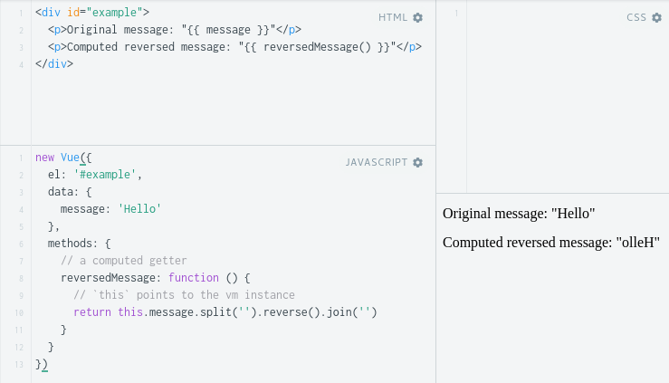


---

# Methods, Computed and Watchers

## Methods

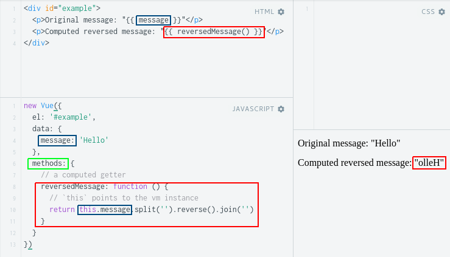


---

# Methods, Computed and Watchers

## Computed properties

.col-6[
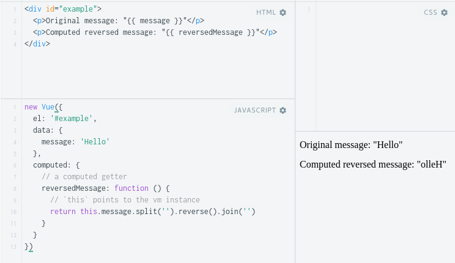
]

---

# Methods, Computed and Watchers

## Computed properties

.col-6[
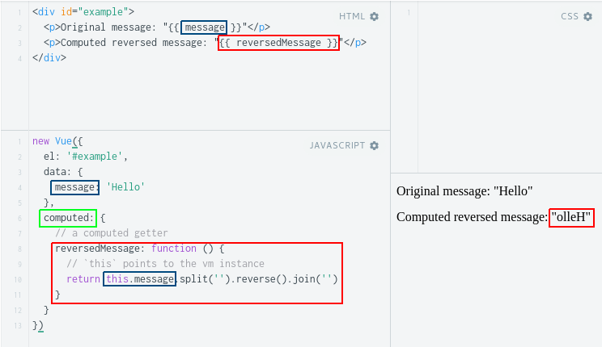
]

.col-6[
We could use a javascript inline expresion like: `message.split('').reverse().join('')` or the **method** described before; the difference is that **computed properties are cached based on their dependencies**.

A computed property will only re-evaluate when some of its dependencies have changed. This means as long as `message` has not changed, multiple access to the `reversedMessage` **computed property** will immediately return the previously computed result **without having to run the function again**.
]

---

# Methods, Computed and Watchers

## Watched property

Vue does provide a more generic way to observe and react to data changes on a Vue instance

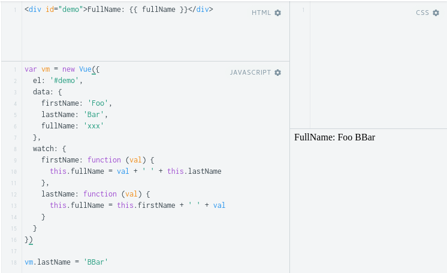

---

# Methods, Computed and Watchers

## Watched property

Vue does provide a more generic way to observe and react to data changes on a Vue instance

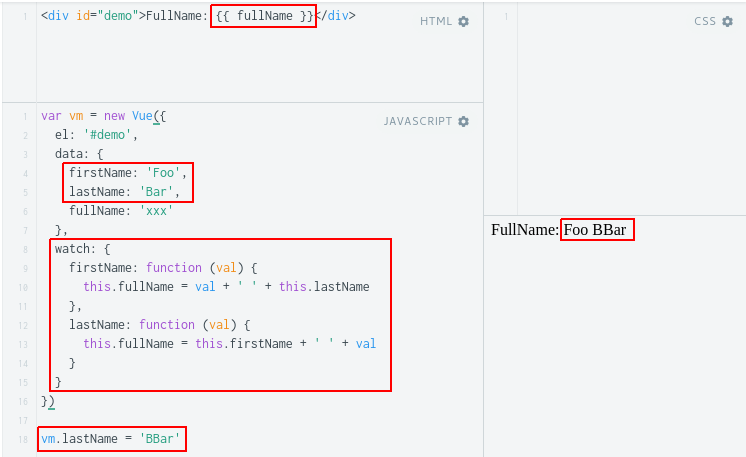

---

# Methods, Computed and Watchers

## Watched property

Last example could be done in less lines and effort using computed property

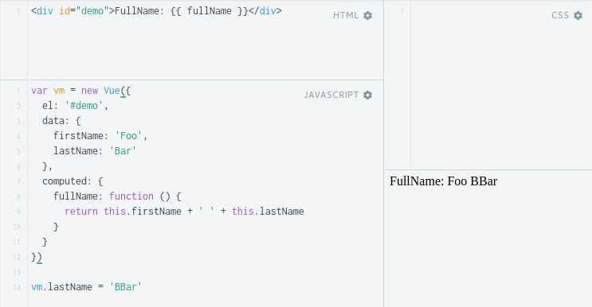

---

# Methods, Computed and Watchers

## Computed Setter

.text-small[
``` javascript
// ...
computed: {
  fullName: {
    // getter
    get: function () {
      return this.firstName + ' ' + this.lastName
    },
    // setter
    set: function (newValue) {
      var names = newValue.split(' ')
      this.firstName = names[0]
      this.lastName = names[names.length - 1]
    }
  }
}
// ...
vm.fullName = 'John Doe'
```
]

---

# Components

Components are one of the most powerful features of Vue. They help you extend basic HTML elements to encapsulate reusable code

- Components live inside a `Vue Instance`
- Registered with and `id` that will be the tag in DOM for the component
- Components are reusable
- Components could be global or local

---

# Components - Global

This is an example code of global component

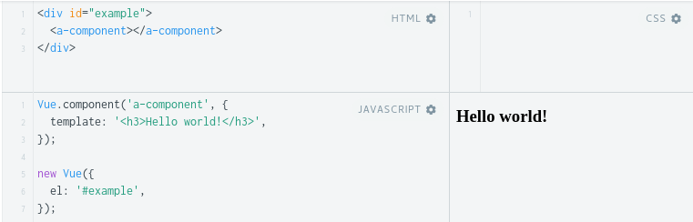

---

# Components - Global

This is an example code of global component

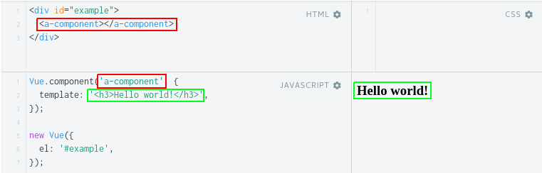

---

# Components - Local

This is an example code of local component.

`Child` var could also be included using `import` or `require`

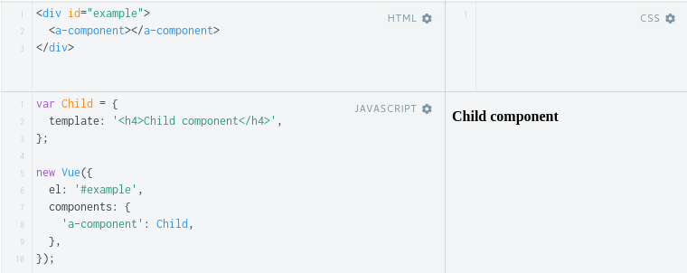

---

# Components - Local

This is an example code of local component.

`Child` var could also be included using `import` or `require`

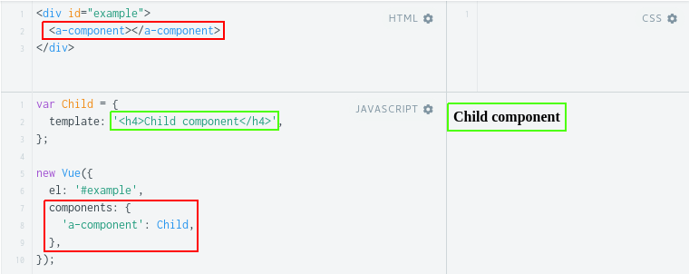

---

# Components - Passing Data with Props

- VueJS uses one way data flow, from parent to child
- `Parent` passes data to child and `Child` receives it as a prop
- If `Parent` changes data, prop changes in `Child`
- Component **should not** directly alter its own props
> A child component needs to explicitly declare the props it expects to receive using the props option


---

# Components - Props example

Using the last example:

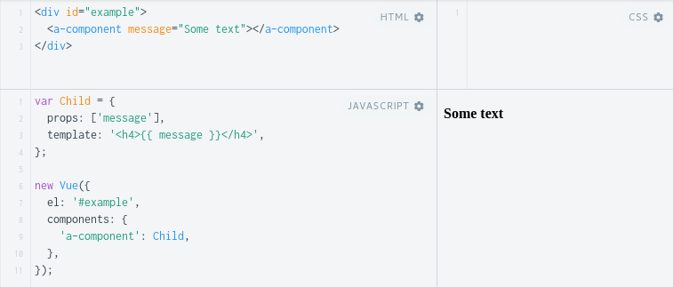

---

# Components - Props example

Using the last example:

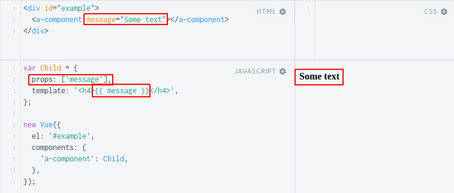

---

# Components - Props validation

.text-small[

``` javascript
...
  props: {
    propA: Number, //`null` means accept any type
    propB: [String, Number],
    propC: {
      type: String,
      required: true,
      default: 'some Text'
    },
    propE: {
      type: Object,
      default: function () { return { message: 'hello' } }
    },
    propF: {
      validator: (value) => value > 10
    }
  }
...
```
]

---

# Components - Parent-Child

- Parent use a child component and pass props to it (`v-bind`)
- Child captures the prop and `$emit` an event (`v-on`)

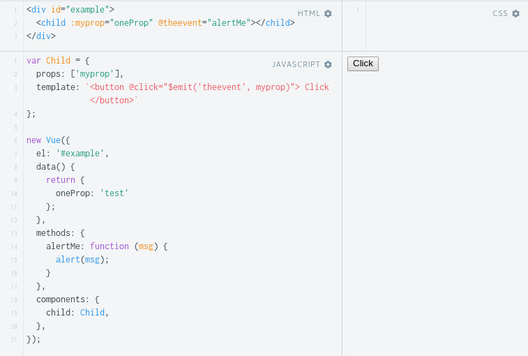

---

# Components - Parent-Child

- Parent use a child component and pass props to it (`v-bind`)
- Child captures the prop and `$emit` an event (`v-on`)

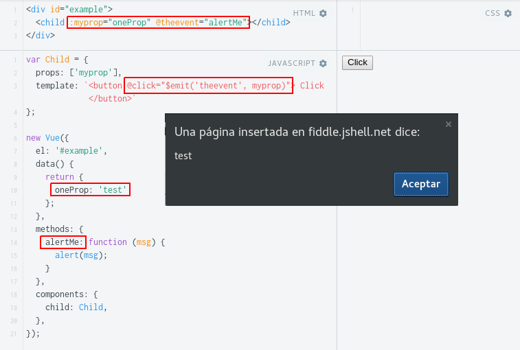

---

# Components - v-model binding

``` html
<!-- `picked` is a string "a" when checked -->
<input type="radio" v-model="picked" value="a">

<!-- `toggle` is either true or false -->
<input type="checkbox" v-model="toggle">

<!-- `selected` is a string "abc" when selected -->
<select v-model="selected">
  <option value="abc">ABC</option>
</select>
```

``` html
<custom-input v-model="price"></custom-input>
```

- In child component props `value` must be defined and emit event must be `input`

---

# Components - Slots

## Single slot

.col-6[

Suppose we have a component called `my-component` with the following template:

``` html
<div>
  <h2>I'm the child title</h2>
  <slot>
    Some text on empty slot.
  </slot>
</div>
```
]

.col-6[

And a parent that uses the component:

``` html
<div>
  <h1>I'm the parent title</h1>
  <my-component>
    <p>Content1</p>
    <p>Content2</p>
  </my-component>
</div>
```
]

---

# Components - Slots

## Single slot

The rendered result will be:

``` html
<div>
  <h1>I'm the parent title</h1>
  <div>
    <h2>I'm the child title</h2>
    <p>Content1</p>
    <p>Content2</p>
  </div>
</div>
```

---

# Components - Slots

## Named slot

.col-6[
Using the example before we could define a component like:

``` html
<div>
  <header>
    <slot name="title"></slot>
  </header>
  <slot></slot>
  <footer>
    <slot name="footer"></slot>
  <footer>
</div>
```
]

.col-6[

And a parent that uses the component:

``` html
<div>
  <h1>I'm the parent title</h1>
  <my-component>
    <p>Content1</p>
    <p>Content2</p>
    <h3 slot="title">The header</h3>
    <span slot="footer">
      footer
    </span>
  </my-component>
</div>
```
]
---

# Components - Slots

## Named slot

The rendered result will be:

``` html
<div>
  <h1>I'm the parent title</h1>
  <div>
    <header><h3>The header</h3></header>
    <p>Content1</p>
    <p>Content2</p>
    <footer>
      <span>footer</span>
    </footer>
  </div>
</div>
```

---

# Components - Register names

When registering components (or props), you can use kebab-case, camelCase, or PascalCase.

``` javascript
components: {
  'kebab-cased-component': { /* ... */ },
  camelCasedComponent: { /* ... */ },
  PascalCasedComponent: { /* ... */ }
}
```

Within HTML templates though, you have to use the kebab-case equivalents:

``` html
<kebab-cased-component></kebab-cased-component>
<camel-cased-component></camel-cased-component>
<pascal-cased-component></pascal-cased-component>
```

---

# Filters

Vue does not include filters in core but you could define a new one like:

``` javascript
new Vue({
  // ...
  filters: {
    filterName: function (value) {
      // ...
      return valueMod;
    },
  },
});
```

Filters could be chained

``` html
{{ message | filterName | filterA | filterB }}
```

---

# Vue router

Routers in vue are included in a separated package that could be installed in projects like:

``` bash
npm install vue-router
```

And included in main app with `Vue.use()` function:

``` javascript
var Vue = require('vue');
var VueRouter = require('vue-router');

Vue.use(VueRouter);
```

---

# Vue router

Usage of vue router is separated in html tags and router definition object.

``` html
<div id="app">
  <h1>Hello App!</h1>
  <p>
    <router-link to="/foo">Go to Foo</router-link>
    <router-link to="/bar">Go to Bar</router-link>
  </p>

  <router-view></router-view>
</div>
```

- `router-link` will be rendered as an `<a>` tag by default (could be personalized) and it is used to navigate in application
- `router-view` is used to render matching component route

---

# Vue router definition

- Initialize components to render
``` javascript
const Foo = { template: '<div>foo {{ $route.params.id }}</div>' }
const Bar = { template: '<div>bar</div>' }
```
- Create `VueRouter` object with components for each route
``` javascript
const router = new VueRouter({
  routes: [
    { path: '/foo/:id', component: Foo },
    { path: '/bar', component: Bar }
  ]
})
```
---

# Vue router definition

- Integrate router into vue instance
``` javascript
new Vue({
  el: '#app',
  router // short for router: router
})
```

Inside component, it is called like `this.$route` and `this.$router`; examples:

- `this.$route.params.id`
- `this.$router.go(-1)`
- `this.$router.push('/bar')`

---

...


---

# The basics

## Getting started

Use [Markdown](https://github.com/adam-p/markdown-here/wiki/Markdown-Cheatsheet) to write your slides. Don't be afraid, it's really easy!

--

## Making points

Look how you can make *some* points:
--

- Create slides with your **favorite text editor**
--

- Focus on your **content**, not the tool
--

- You can finally be **productive**!

---

# There's more

## Syntax highlighting

You can also add `code` to your slides:
```html
<div class="impact">Some HTML code</div>
```

## CSS classes

You can use .alt[shortcut] syntax to apply .big[some style!]

...or just <span class="alt">HTML</span> if you prefer.

---

# And more...

## 12-column grid layout

Use to the included **grid layout** classes to split content easily:
.col-6[
  ### Left column

  - I'm on the left
  - It's neat!
]
.col-6[
  ### Right column

  - I'm on the right
  - I love it!
]

## Learn the tricks

See the [wiki](https://github.com/gnab/remark/wiki) to learn more of what you can do with .alt[Remark.js]
